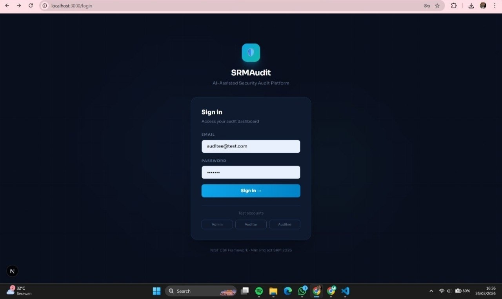
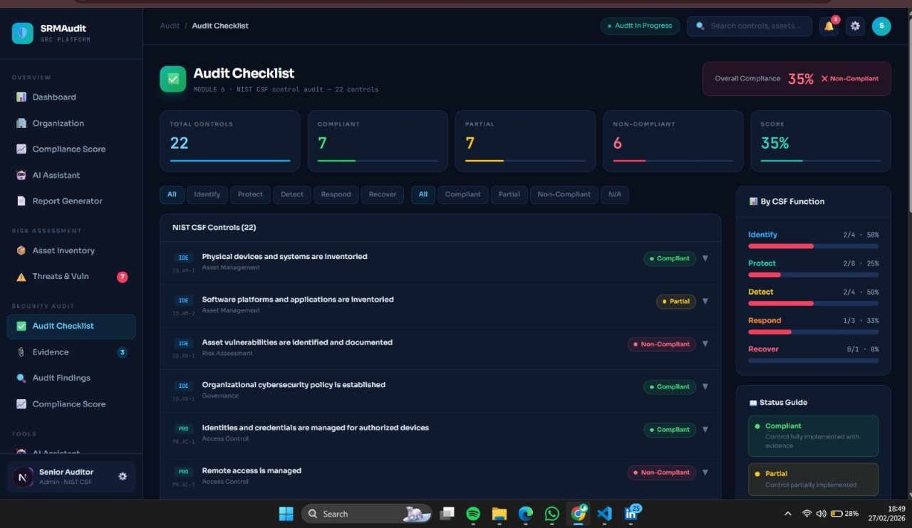
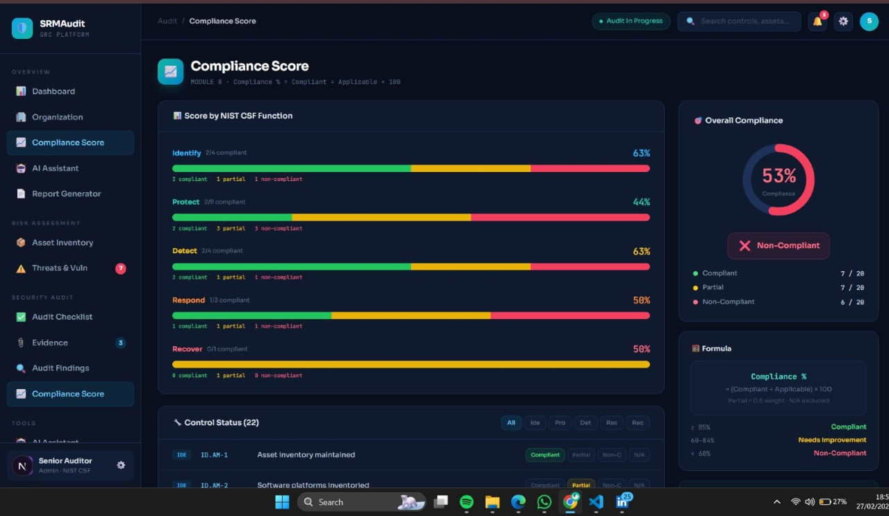
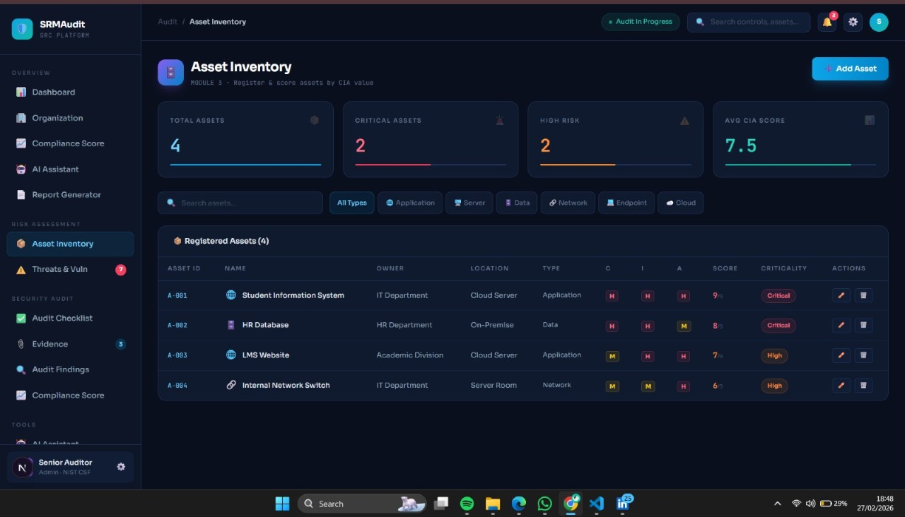
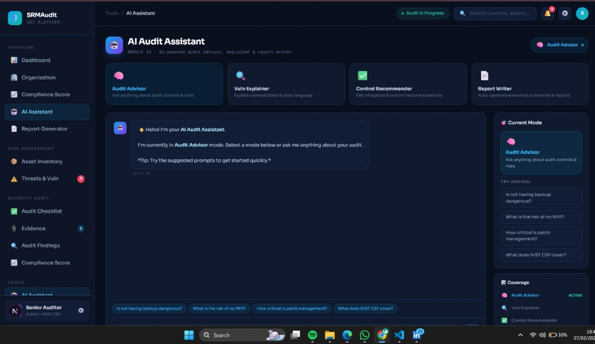
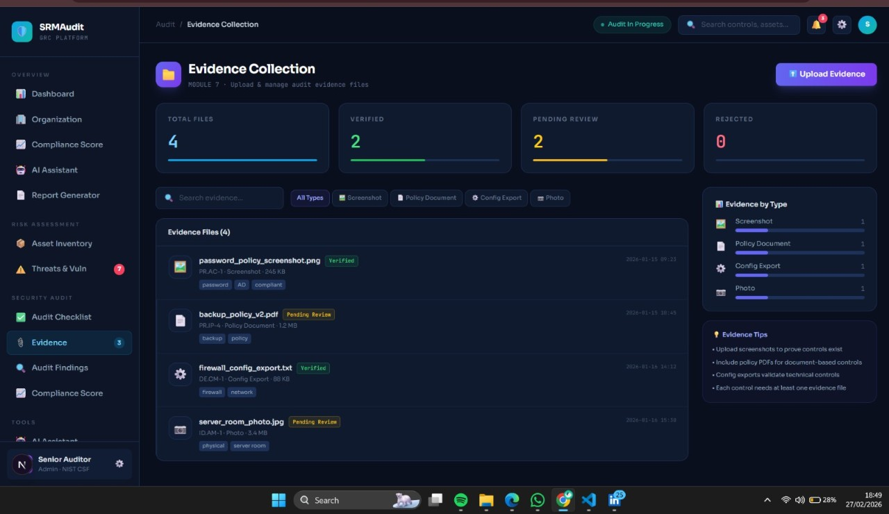
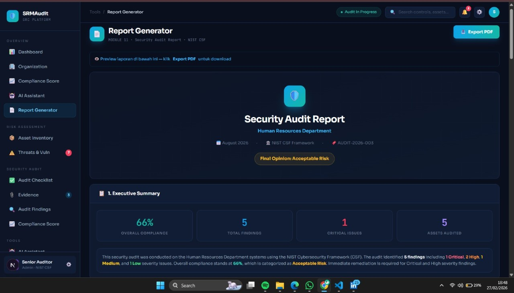
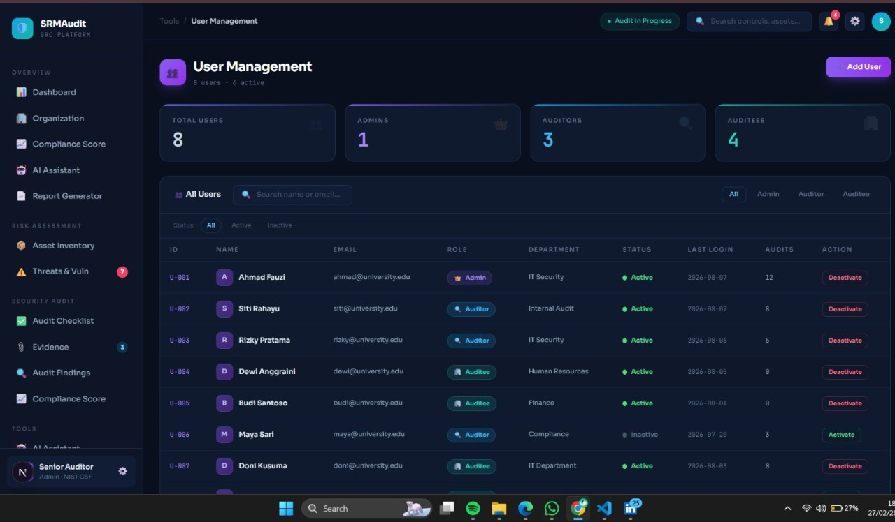

# SRMAudit — Security Risk Management & Audit Platform

A full-stack GRC (Governance, Risk & Compliance) web application for conducting structured cybersecurity audits based on the NIST Cybersecurity Framework (NIST CSF).

## 🔍 Overview

SRMAudit helps organizations perform end-to-end security audits — from asset discovery and vulnerability mapping to compliance scoring and automated report generation.

## ✨ Features

- **Dashboard** — Real-time audit progress, risk matrix (5×5), and NIST CSF compliance overview
- **Organization Profile** — Define audit scope and auto-calculate exposure level
- **Asset Inventory** — Register and score assets by CIA (Confidentiality, Integrity, Availability) value
- **Threats & Vulnerabilities** — OWASP-based vulnerability identification and risk mapping
- **Audit Checklist** — 22 NIST CSF controls across Identify, Protect, Detect, Respond, Recover
- **Evidence Collection** — Upload and manage audit evidence files (screenshots, policy docs, config exports)
- **Audit Findings** — Track findings by severity (Critical/High/Medium/Low) with assignee and status
- **Compliance Score** — Auto-calculated compliance percentage per CSF function
- **AI Audit Assistant** — AI-powered advisor for audit controls, vuln explanation, and report writing
- **Report Generator** — Generate and export professional Security Audit Reports as PDF
- **User Management** — Role-based access control (Admin, Auditor, Auditee)

## 🛠️ Tech Stack

- **Frontend:** Next.js, TypeScript, Tailwind CSS
- **Framework:** React

## 🚀 Getting Started

```bash
npm install
npm run dev
```

Open [http://localhost:3000](http://localhost:3000) in your browser.

## 📸 Screenshots

## 📸 Screenshots










